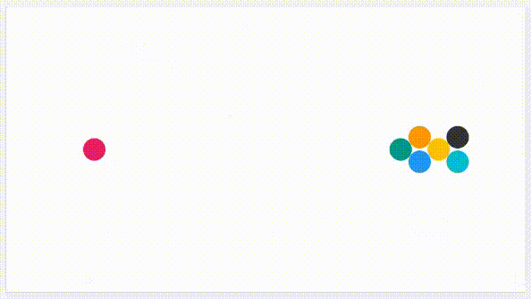

# physics-simulations-balls

Understand the concepts, equations and code needed for simulating the movement and collisions of balls.

 

| | | |
| --- | --- | --- |
| [level 0 - the basics](https://github.com/pitizzzle/physics-simulations-balls/blob/main/level-0-the-basics.md) |||
| [level 1 - uniform motion](https://github.com/pitizzzle/physics-simulations-balls/blob/main/level-1-uniform-motion.md) | [Code](https://github.com/pitizzzle/physics-simulations-balls/blob/main/code/level-1-uniform-motion.html) | [Code Live](https://pitizzzle.github.io/simulate-ball-physics/code/level-1-uniform-motion.html) |
| [level 2 - accelerated motion](https://github.com/pitizzzle/physics-simulations-balls/blob/main/level-2-accelerated-motion.md) | [Code](https://github.com/pitizzzle/physics-simulations-balls/blob/main/code/level-2-accelerated-motion.html) | [Code Live](https://pitizzzle.github.io/simulate-ball-physics/code/level-2-accelerated-motion.html) |
| [level 3 - wall deterministic collisions](https://github.com/pitizzzle/physics-simulations-balls/blob/main/level-3-wall-deterministic-collisions.md) | [Code](https://github.com/pitizzzle/physics-simulations-balls/blob/main/code/level-3-wall-deterministic-collisions.html) | [Code Live](https://pitizzzle.github.io/simulate-ball-physics/code/level-3-wall-deterministic-collisions.html) |
| [level 4 - ball deterministic collisions](https://github.com/pitizzzle/physics-simulations-balls/blob/main/level-4-ball-deterministic-collisions.md) | [Code](https://github.com/pitizzzle/physics-simulations-balls/blob/main/code/level-4-ball-deterministic-collisions.html) | [Code Live](https://pitizzzle.github.io/simulate-ball-physics/code/level-4-ball-deterministic-collisions.html) |
| [level 5 - wall spring collisions](https://github.com/pitizzzle/physics-simulations-balls/blob/main/level-5-wall-spring-collisions.md) | [Code](https://github.com/pitizzzle/physics-simulations-balls/blob/main/code/level-5-wall-spring-collisions.html) | [Code Live](https://pitizzzle.github.io/simulate-ball-physics/code/level-5-wall-spring-collisions.html) |
| [level 6 - ball spring collisions](https://github.com/pitizzzle/physics-simulations-balls/blob/main/level-6-ball-spring-collisions.md) | [Code](https://github.com/pitizzzle/physics-simulations-balls/blob/main/code/level-6-ball-spring-collisions.html) | [Code Live](https://pitizzzle.github.io/simulate-ball-physics/code/level-6-ball-spring-collisions.html) |
| [level 7 - mouse constraint and friction](https://github.com/pitizzzle/physics-simulations-balls/blob/main/level-7-mouse-constraint-and-friction.md) | [Code](https://github.com/pitizzzle/physics-simulations-balls/blob/main/code/level-7-mouse-constraint-and-friction.html) | [Code Live](https://pitizzzle.github.io/simulate-ball-physics/code/level-7-mouse-constraint-and-friction.html) |
| [level 8 - beyond](https://github.com/pitizzzle/physics-simulations-balls/blob/main/level-8-beyond.md) | | |
