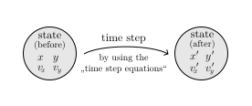
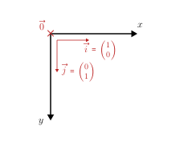

## time steps
+ If we had a single moving object, like a ball accelerating downwards due to gravity, we could deterministically compute its physical variables (like position and velocity) as a function of time ...
$$
\begin{aligned}
y(t) &= \dfrac{g}{2} \cdot t^2\\
v(t) &= g \cdot t
\end{aligned}
$$
+ But in more complex simulations the position and velocity of a moving object depend on the interactions it has with its environment, whose results we most oftenly can't easily express as a function of time.
  - Example: If we simulate the balls on a billiard table (like we will do from level 4 and on), the collisions between the balls are too complex and interrelated to be able to predict the position of each ball as a function of time.
  - [BILLIARD GIF]
+ The universal approach to such complex simulations is breaking it up into small incremental **time steps** (eg. time steps of length 1 millisecond).

  

<!-- + A methodology quite similar to the concept of [numerical integration](https://en.wikipedia.org/wiki/Numerical_integration) and the [Riemann integral](https://en.wikipedia.org/wiki/Riemann_integral). -->

+ Because the time steps are really small, we are allowed the following approximations:
  * (1. Approxim.) The motion update which happens during each time step is free/uninterrupted from any interactions/collisions. Only after (or before) the motion update in each time step we check for and execute updates for any interactions/collisions. This eliminates the complex interrelation of motion and interactions/collisions. We simply divide it into to distinct procedures.
  * (2. Approxim.) Physical variables like the velocity or the acceleration of an object may be assumed to be constant during a time step, because they should not change much during such small time anyway.
+ Because of these two approximations, our simulations are not 100% accurate. But they're pretty close. And the smaller the time steps, the more accurate the approximation.
+ And finally one last thing. There are different "styles" of updating the physical variables of objects like position, velocity and acceleration with the time step equations. I call them "styles" because all of them are just approximations.
  - A common difference between these styles of updating motion in the time step equations is whether they assume forces and velocities to be strictly constant during the time step or if they actually take some kind of averaging approach, for example assuming the physical variables change linearly from one state to another.
  - Don't worry about this, for now. This concept will be revisited a couple of times.
<!--
+ Example:
  - The most simple and straight-forward way of doing a motion update is computing the sum of forces on our object based on the current state, then compute the acceleration equivalent of that force, then assume this acceleration to be constant for the period of this time step and compute the velocity for after the time step, then use this new velocity or the old velocity to compute the new position of the object after the time step.
  - A more advanced
+ We will explore different styles of motion updates in the following levels. For now, just understand that there is not one right way to do it.
+ A critical characteristic of update rules in general is that update rules are () not right or wrong. All update rule sets are only approximations, or "styles" to simulate something.
+ They differ in ..
  - complexity (less is better)
  - and accuracy/realism (more is better)
+ [NOT TESTED YET] it seems like there is always a clear winner in terams of accuracy, but it's usually the most complex, and it depends on the circumstance how much we can step down and still have accurate results
+ The accuracy and realism of a set of update rules depends on the concrete circumstances in your simulation.
  - See "Level 3 - Wall Collisions Deterministic" as a good example for that. Especially if you compare with "XXXXXX" (Level 6? averaged velocities for spring collisions)
+ So you have to assess which update rules are best suited for your simulation. It's not always that easy.
  - Either you go the theoretical path, trying to figure out on paper which appromixations are most accurate, ..
  - or you go the practical path, simply piting different update rule sets against each other and comparing their results (which is often easier and faster, but may leave some insights undiscovered).
-->
  

## collisions
+ A collision between two simulated objects (eg. a ball and another ball) is detected by checking whether their geometric shapes (circles in our case) overlap. Because if they overlap, the objects must have bumped into each other.
  

+ The same applies to a collision between a ball and a wall. If the ball "sticks" in the wall (overlaps with it) it must have bumped into it.
  

  

## dimensions, coordinate system
+ We stick to 2D simulations.
  - 3D simulations would basically work the same way, but we don't want to rush things for now 😁.
+ So we have the $x$ and the $y$ dimension in a cartesian coordinate system.
  

+ Some physical variables of the balls thereby become vectors, meaning they're split up in their respective $x$ and $y$ components:
$$
\vec{p} = \begin{pmatrix}x\\ y\end{pmatrix} \quad
\vec{v} = \begin{pmatrix}v_x\\ v_y\end{pmatrix} \quad
\vec{a} = \begin{pmatrix}a_x\\ a_y\end{pmatrix}
$$

  
