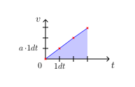

## goal
+ Let an initially stationary ball accelerate by simulating the push of a random but constant force.

<br>

## equations
<div align="center"></div><!--
\text{--------- constants ---------}
--><br>

<div align="center"></div><!--
\begin{aligned}
F_x &= const. \\
F_y &= const. \\
m &= const. \\[2pt]
a_x &= \dfrac{F_x}{m} = const. \\[6pt]
a_y &= \dfrac{F_y}{m} = const.\\[8pt]
\end{aligned}
--><br>

<div align="center"></div><!--
\text{--------- time step ---------}
--><br>

<div align="center"></div><!--
\text{\small\color{Gray} (new velocity after the time step)}
--><br>

<div align="center"></div><!--
\begin{aligned}
v'_x &= v_x + dv_x  &  &\leftarrow  &  dv_x &= dt \cdot a_x\\
v'_y &= v_y + dv_y  &  &\leftarrow  &  dv_y &= dt \cdot a_y\\[8pt]
\end{aligned}
--><br>

<div align="center"></div><!--
\text{\small\color{Gray} (new position, using the new velocity)}
--><br>

<div align="center"></div><!--
\begin{aligned}
x'&= x + dx  &  &\leftarrow  &  dx&= dt \cdot v'_x\\
y'&= y + dy  &  &\leftarrow  &  dy&= dt \cdot v'_y\\[8pt]
\end{aligned}
--><br>

<br>

## code equivalent
```js
const ball = {
    x: 0.5 * canvas.w,  // center of canvas
    y: 0.5 * canvas.h,  //
    v_x: 0,  // initially stationary
    v_y: 0,  //
    m: 1,
};

const F_x = Math.random() * 0.4 - 0.2;  // random value in interval [-0.2; 0.2)
const F_y = Math.random() * 0.4 - 0.2;  //

function simulateOneStep(dt) {
    const a_x = F_x / ball.m;
    const a_y = F_y / ball.m;
    ball.v_x += dt * a_x;
    ball.v_y += dt * a_y;
    ball.x += dt * ball.v_x;
    ball.y += dt * ball.v_y;
}
```

<br>

## discussion of the time step equations
+ If you pay close attention to the time step equations above, you will notice that they're not 100% physically accurate.
+ The ball's position is always updated using the new velocity (that belongs to the state AFTER the time step), assuming this new velocity is already present and constant during the time step itself.
  <div align="center"></div>

+ In reality, this should not be the case. During the time step, to update the position we should assume that the velocity changes linearly from the start velocity to the new velocity, instead of having the new velocity all the time.
  <div align="center"></div>

+ To correct our time step equations in that regard, to update the position we can simply use the average velocity for each time step (ie. the mean of the old velocity and the new velocity), which is equivalent to the linear change from above.
  <div align="center"></div>

+ And then, how big is the error of our initial time step equations, compared to the physically correct ones?
  - The velocities after each time step are 100% identical.
  - The position has an error, as we already figured out.
  - Looking at the diagrams, we can clearly see, that the <!--v(t)--> graph of our initial time step equations is just shifted upwards by <!--0.5 \cdot a \cdot 1dt--> compared to the phyiscally correct time step equations.
  <div align="center"></div>

  - This means the error of our initial simple time step equations becomes smaller (relatively speaking) if we travel at high velocity, and it becomes smaller as well if we make the time steps smaller.
  <div align="center"></div>

+ To summarize, ..
  - We could use the initial simple time step equations and would probably don't see a difference.
  - But theoretically, it becomes slightly more physically accurate if we use the average velocity to update the position, because compared to our initial time step equations there is a small error margin.

<br>


## equations <small>(using average velocity) (only what changed)</small>
<div align="center"></div><!--
\text{--------- time step ---------}
--><br>

<div align="center"></div><!--
\text{\small\color{Gray} (new position, using the average velocity)}
--><br>

<div align="center"></div><!--
\begin{aligned}
x'&= x + dx  &  &\leftarrow  &  dx&= dt \cdot \dfrac{v_x + v'_x}{2}\\[8pt]
y'&= y + dy  &  &\leftarrow  &  dy&= dt \cdot \dfrac{v_y + v'_y}{2}\\[8pt]
\end{aligned}
--><br>

<br>


## code equivalent <small>(using average velocity) (only what changed)</small>
```js
// ...

function simulateOneStep(dt) {
    const a_x = F_x / ball.m;
    const a_y = F_y / ball.m;
    const v_x_old = ball.v_x;
    const v_y_old = ball.v_y;
    ball.v_x += dt * a_x;
    ball.v_y += dt * a_y;
    ball.x += dt * 0.5 * (v_x_old + ball.v_x);
    ball.y += dt * 0.5 * (v_y_old + ball.v_y);
}
```

<br>


## working example <small>(for all variants)</small>

|||
| --- | --- |
| [Code](https://github.com/pitizzzle/physics-simulations-balls/blob/main/code/level-2-accelerated-motion.html) | [Code Live](https://pitizzzle.github.io/simulate-ball-physics/code/level-2-accelerated-motion.html) |
