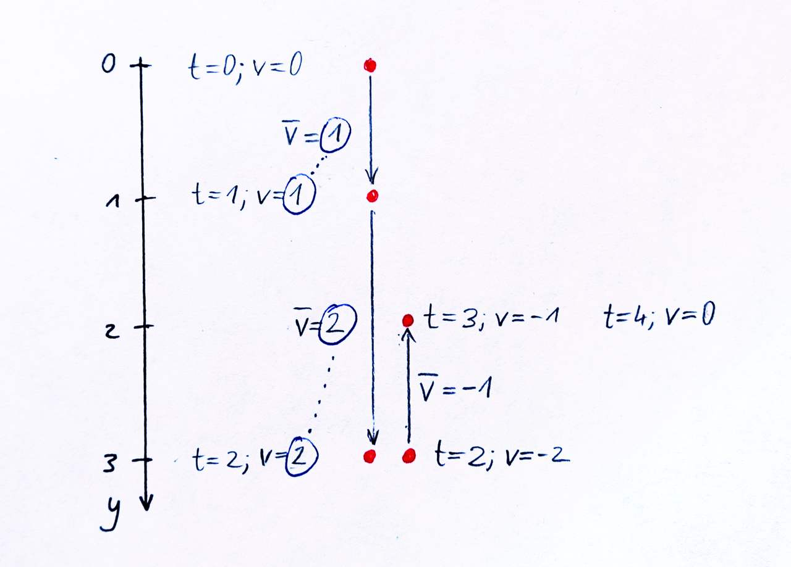
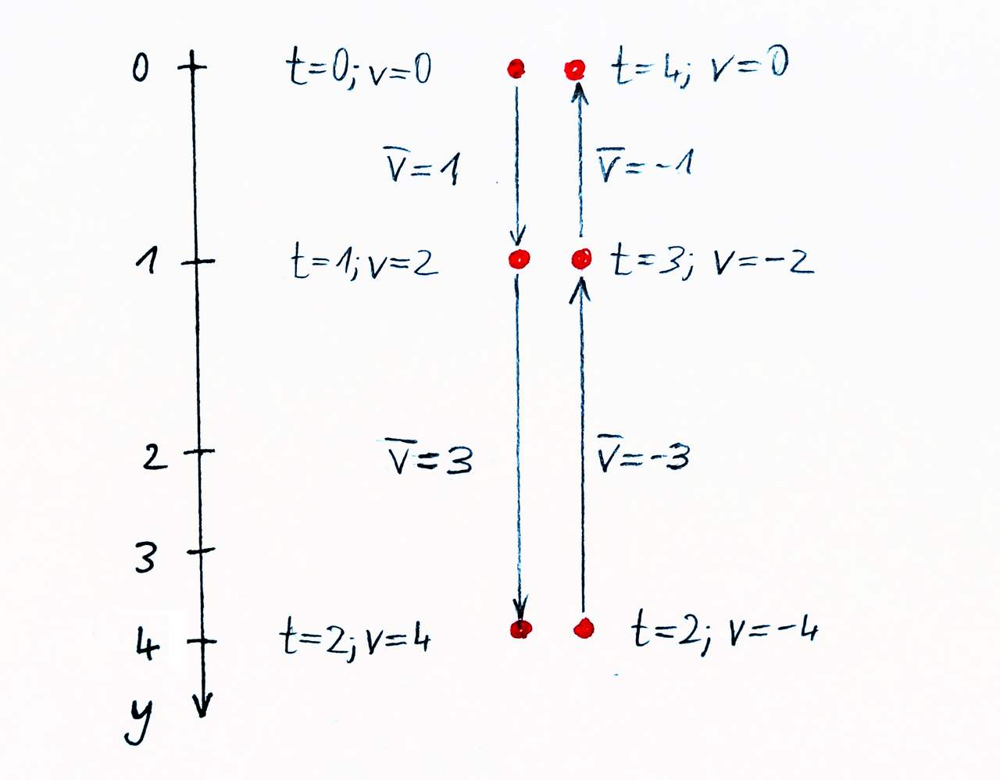

## goal
+ Simulate a ball that bounces off all the walls if it touches them.
+ The ball is initially stationary, and gravity is constantly acting on it downwards.

<br>

## equations

$$
\text{--------- constants ---------}
$$

$$
\begin{aligned}
\text{\hspace{50pt}}
m &= \text{const.}\text{\small\color{gray}\hspace{14pt}(mass of the ball)}\\
g &= \text{const.}\text{\small\color{gray}\hspace{14pt}(gravity constant)}\\
r&=\text{const.}\text{\small\color{gray}\hspace{14pt}(radius of the ball)}\\
w&=\text{const.}\text{\small\color{gray}\hspace{14pt}(width of the scene)}\\
h&=\text{const.}\text{\small\color{gray}\hspace{14pt}(height of the scene)}\\[8pt]
\end{aligned}
$$

$$
\text{--------- time step ---------}
$$

$$
\text{\small\color{gray} (update the force -- will be constant for this time step)}
$$

$$
\begin{aligned}
F_x &= 0\\[8pt]
F_y &= m \cdot g\\[8pt]
\end{aligned}
$$

$$
\text{\small\color{gray} (update the acceleration -- will be constant for this time step)}
$$

$$
\begin{aligned}
a_x &= \frac{F_x}{m}\\[8pt]
a_y &= \frac{F_y}{m}\\[8pt]
\end{aligned}
$$

$$
\text{\small\color{gray} (update the velocity -- will be constant for this time step)}
$$

$$
\begin{aligned}
v'_x &= v_x + dv_x  &  &\leftarrow  &  dv_x &= dt \cdot a_x\\
v'_y &= v_y + dv_y  &  &\leftarrow  &  dv_y &= dt \cdot a_y\\[8pt]
\end{aligned}
$$

$$
\text{\small\color{gray} (update the position)}
$$

$$
\begin{aligned}
x'&= x + dx  &  &\leftarrow  &  dx&= dt \cdot v'_x\\
y'&= y + dy  &  &\leftarrow  &  dy&= dt \cdot v'_y\\[8pt]
\end{aligned}
$$

$$
\text{--------- wall collisions ---------}
$$

$$
\text{\small\color{gray} (left and right wall)}
$$

$$
\begin{aligned}
v''_x =
\begin{cases}
    + \left| v'_x \right|, & \text{if}\:\:\: x-r \lt 0\\
    - \left| v'_x \right|, & \text{if}\:\:\: x+r \gt w\\
    v'_x,               & \text{otherwise}
\end{cases}\\[24pt]
\end{aligned}
$$

$$
\text{\small\color{gray} (top and bottom wall)}
$$

$$
\begin{aligned}
v''_y =
\begin{cases}
    + \left| v'_y \right|, & \text{if}\:\:\: y-r \lt 0\\
    - \left| v'_y \right|, & \text{if}\:\:\: y+r \gt h\\
    v'_y,               & \text{otherwise}
\end{cases}
\end{aligned}
$$


<br>

## code
```js
const ball = {
    x: 0.5 * canvas.w,  // horizontally centered
    y: 0.2 * canvas.h,  // at the top
    v_x: 0,  // initially stationary
    v_y: 0,  //
    m: 1,
    r: 15,
};

const g = 0.5;  // gravity constant

function simulateOneStep(dt) {
    const F_x = 0;
    const F_y = ball.m * g;

    const a_x = F_x / ball.m;
    const a_y = F_y / ball.m;
    
    ball.v_x += dt * a_x;
    ball.v_y += dt * a_y;

    ball.x += dt * ball.v_x;
    ball.y += dt * ball.v_y;

    if (ball.x - ball.r < 0) {
        ball.vx = Math.abs(ball.vx);
    }
    if (ball.x + ball.r - w > 0) {
        ball.vx = - Math.abs(ball.vx);
    }
    if (ball.y - ball.r < 0) {
        ball.vy = Math.abs(ball.vy);
    }
    if (ball.y + ball.r - h > 0) {
        ball.vy = - Math.abs(ball.vy);
    }
}
```

<br>


## the problem
+ You will notice, that using the update rules above, the ball jumps lower with every bounce off the ground.
+ It's true that simulating motion in discrete time steps is just an approximation, and therefore not 100% accurate. But normally, you don't actually see the inaccuracy this drastically, because the errors resulting in lower-than-reality speeds balance out with errors resulting in higher-than-reality speeds. If you see that errors constructively accumulate, like that the ball is jumping lower and lower, you know that there must be a systematic flaw in your simulation rules.
+ In this special case here (gravity force and deterministic collision detection), our update rules are suboptimal. We treat the new velocity (for the state AFTER the time step) as the average velocity DURING the step. This conflicts with simply reversing the direction of velocity on collisions.
+ By looking at a simplified example we can figure it out.

<div align="center"></div>

+ This is the reason why the ball loses velocity systematically.
+ The solution? Let's apply the ACTUAL average velocity for each time step, instead of treating the new velocity (for the state after the time step) as the average velocity during the time step.

<div align="center"></div>

+ As you can see, the ball jumps up again to the same height it initially started with. Symmetry successfully restored.

<br>


## equations <small>(using average velocity) (only what changed)</small>
$$
\text{--------- time step ---------}
$$

$$
\text{\small\color{gray} (update the velocity -- will NOT be constant for this time step)}
$$

$$
\begin{aligned}
v'_x &= v_x + dv_x  &  &\leftarrow  &  dv_x &= dt \cdot a_x\\
v'_y &= v_y + dv_y  &  &\leftarrow  &  dv_y &= dt \cdot a_y\\[8pt]
\end{aligned}
$$

$$
\text{\small\color{gray} (update position -- using the average velocity)}
$$

$$
\begin{aligned}
x' &= x + dx  &  &\leftarrow  &  dx&= dt \cdot \frac{v_x + v'_x}{2}\\[8pt]
y' &= y + dy  &  &\leftarrow  &  dy&= dt \cdot \frac{v_y + v'_y}{2}\\[8pt]
\end{aligned}
$$

<br>


## code <small>(using average velocity) (only what changed)</small>
```js
// ...

function simulateOneStep(dt) {
    // ...
    
    const v_x_old = ball.v_x;
    const v_y_old = ball.v_y;
    ball.v_x += dt * a_x;
    ball.v_y += dt * a_y;
    
    ball.x += dt * 0.5 * (v_x_old + ball.v_x);
    ball.y += dt * 0.5 * (v_y_old + ball.v_y);

    // ...
}
```

<br>


## working example <small>(for both update rule sets)</small>

||||
| --- | --- | --- |
| [Code]() | [Code Live]() | [Code Fiddle]() |
