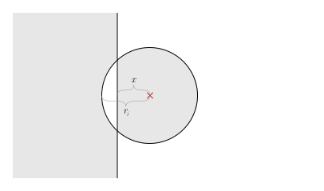

## goal
+ Simulate a ball that bounces off all the walls if it touches them.
+ The ball is initially stationary, and gravity is constantly acting on it downwards.

<br>


## equations

$$
\text{--------- constants ---------}
$$

$$
\begin{aligned}
\text{\hspace{50pt}}
m &= \text{const.}\text{\small\color{gray}\hspace{14pt}(mass of the ball)}\\
g &= \text{const.}\text{\small\color{gray}\hspace{14pt}(gravity constant)}\\
r&=\text{const.}\text{\small\color{gray}\hspace{14pt}(radius of the ball)}\\
w&=\text{const.}\text{\small\color{gray}\hspace{14pt}(width of the scene)}\\
h&=\text{const.}\text{\small\color{gray}\hspace{14pt}(height of the scene)}\\[8pt]
\end{aligned}
$$

$$
\text{--------- time step ---------}
$$

$$
\text{\small\color{gray} (new force, which is constant during the time step)}
$$

$$
\begin{aligned}
F_x &= 0\\[8pt]
F_y &= m \cdot g\\[8pt]
\end{aligned}
$$

$$
\text{\small\color{gray} (new acceleration, which is constant during the time step)}
$$

$$
\begin{aligned}
a_x &= \frac{F_x}{m}\\[8pt]
a_y &= \frac{F_y}{m}\\[8pt]
\end{aligned}
$$

$$
\text{\small\color{gray} (new velocity after the time step)}
$$

$$
\begin{aligned}
v'_x &= v_x + dv_x  &  &\leftarrow  &  dv_x &= dt \cdot a_x\\
v'_y &= v_y + dv_y  &  &\leftarrow  &  dv_y &= dt \cdot a_y\\[8pt]
\end{aligned}
$$

$$
\text{\small\color{gray} (new position, using the new velocity)}
$$

$$
\begin{aligned}
x'&= x + dx  &  &\leftarrow  &  dx&= dt \cdot v'_x\\
y'&= y + dy  &  &\leftarrow  &  dy&= dt \cdot v'_y\\[8pt]
\end{aligned}
$$

$$
\text{--------- wall collisions ---------}
$$

<div align="center"></div>

$$
\text{\small\color{gray} (left and right wall)}
$$

$$
\begin{aligned}
v''_x =
    \begin{cases}
        - v'_x, & \text{if}\quad x \lt r \;\;\vee\;\; w-r \lt x\\
        v'_x, & \text{otherwise}
    \end{cases}\\[24pt]
\end{aligned}
$$

$$
\text{\small\color{gray} (top and bottom wall)}
$$

$$
\begin{aligned}
v''_y =
    \begin{cases}
        - v'_y, & \text{if}\quad y \lt r \;\;\vee\;\; h-r \lt y\\
        v'_y, & \text{otherwise}
    \end{cases}
\end{aligned}
$$

<br>


## code
```js
const ball = {
    x: 0.5 * canvas.w,  // horizontally centered
    y: 0.2 * canvas.h,  // at the top
    v_x: 0,  // initially stationary
    v_y: 0,  //
    m: 1,
    r: 15,
};

const g = 0.7;  // gravity constant

function simulateOneStep(dt) {
    const F_x = 0;
    const F_y = ball.m * g;

    const a_x = F_x / ball.m;
    const a_y = F_y / ball.m;
    
    ball.v_x += dt * a_x;
    ball.v_y += dt * a_y;

    ball.x += dt * ball.v_x;
    ball.y += dt * ball.v_y;

    if (ball.x < ball.r || canvas.w - ball.r < ball.x) {
        ball.v_x *= -1;
    }
    if (ball.y < ball.r || canvas.h - ball.r < ball.y) {
        ball.v_y *= -1;
    }
}
```

<br>


## discussion of the time step equations
+ Again, like in level 2, we have utilized the most simple time step equations, which are slightly less accurate than those that use the average velocity to update the position.
+ But this time, unlike in level 2, you will quickly notice a difference. The ball jumps lower with every bounce off the ground with the simple time step equations.
+ This simplified example illustrates that the problem is again due to the fact that we assume the new velocity (that belongs to the state AFTER the time step) to be constant when updating the position of the ball. The collision is not symmetric, the ball approaches the ground with $v=2$ but leaves it with only $v=-1$.

<div align="center"></div>

+ This is easily fixed by using the average velocity to update the position of the ball, because then the collision becomes symmetric, retracting with the same velocity it approached with.

<div align="center"></div>

+ Hint:
  - The problem of asymmetric collisions only applies to special scenarios, like the current one, where a force acts on the ball.
  - In the next level, where we don't have any forces involved, we won't have the problem of asymmetric collisions with the simple update rule (only the problem of slight physical inaccuracy remains).

<br>


## equations <small>(using average velocity) (only what changed)</small>
$$
\text{--------- time step ---------}
$$

$$
\text{\small\color{gray} (new velocity after the time step)}
$$

$$
\begin{aligned}
v'_x &= v_x + dv_x  &  &\leftarrow  &  dv_x &= dt \cdot a_x\\
v'_y &= v_y + dv_y  &  &\leftarrow  &  dv_y &= dt \cdot a_y\\[8pt]
\end{aligned}
$$

$$
\text{\small\color{gray} (new position, using the average velocity)}
$$

$$
\begin{aligned}
x' &= x + dx  &  &\leftarrow  &  dx&= dt \cdot \dfrac{v_x + v'_x}{2}\\[8pt]
y' &= y + dy  &  &\leftarrow  &  dy&= dt \cdot \dfrac{v_y + v'_y}{2}\\[8pt]
\end{aligned}
$$

<br>


## code <small>(using average velocity) (only what changed)</small>
```js
// ...

function simulateOneStep(dt) {
    // ...
    
    const v_x_old = ball.v_x;
    const v_y_old = ball.v_y;
    ball.v_x += dt * a_x;
    ball.v_y += dt * a_y;
    
    ball.x += dt * 0.5 * (v_x_old + ball.v_x);
    ball.y += dt * 0.5 * (v_y_old + ball.v_y);

    // ...
}
```

<br>


## working example <small>(for all variants)</small>

||||
| --- | --- | --- |
| [Code]() | [Code Live]() | [Code Fiddle]() |
