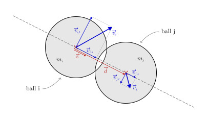

## goal
+ Simulate the motion of multiple balls.
+ There is no gravity, our simulation may be interpreted as a top-down view on a billiard table.
+ Collisions can happen with all the walls, and between each of the balls.
+ All balls, except one, are initially stationary.

<br>


## equations
+ side notes:
  - We don't have any forces involved here. All balls simply have velocities, masses, and radii, and balls collide, the new velocities are computed. No forces.
  - Because we have no (constant) forces involved here, we don't need to use the average velocities for each time step anymore. Think about it – the problem with the ball loosing height was tightly coupled to presence of the gravity force.

<br>


$$
\text{--------- constants ---------}
$$

$$
\begin{aligned}
\text{\hspace{50pt}}
w &= \text{const.}\text{\small\color{gray}\hspace{14pt}(width of the scene)}\\
h &= \text{const.}\text{\small\color{gray}\hspace{14pt}(height of the scene)}\\[8pt]
\end{aligned}
$$


$$
\text{--------- time step ---------}
$$

$$
\text{\small\color{gray} (update the position -- for each ball)}
$$

$$
\begin{aligned}
x'_i &= x_i + dx_i  &  &\leftarrow  &  dx_i &= dt \cdot v_{x,i}\\[8pt]
y'_i &= y_i + dy_i  &  &\leftarrow  &  dy_i &= dt \cdot v_{y,i}\\[8pt]
\end{aligned}
$$


$$
\text{--------- ball-ball collisions ---------}
$$

$$
\text{\small\color{gray} (for every pair of balls, i and j, ...)}
$$

<div align="center"></div>

$$
\begin{gathered}
\vec{p}_i = \begin{pmatrix}x_i\\ y_i\end{pmatrix} \hspace{16pt} \vec{p}_j = \begin{pmatrix}x_j\\ y_j\end{pmatrix} \\[14pt]
\vec{d} = \vec{p}_{\hspace{.5pt}j} - \vec{p}_{\hspace{.5pt}i}\\[8pt]
\text{collision condition:\hspace{12pt}} |\,\vec{d}\:| < r_i + r_j\\[16pt]
\end{gathered}
$$

$$
\begin{gathered}
\text{\small\color{gray} (in case of collision ...)}\\[8pt]
\text{\small By neglecting friction, the balls essentially only collide}\\
\text{\small along the axis of their centers, like in a head-on collision.}\\
\text{\small The velocities perpendicular to the axis of centers}\\
\text{\small remain as they were before.}
\end{gathered}
$$

<div align="center">contribution: <a href="https://phys.libretexts.org/Bookshelves/Classical_Mechanics/Book%3A_Classical_Mechanics_(Tatum)/05%3A_Collisions/5.04%3A_Oblique_Collisions">libretexts.org</a></div>
<br><br>

<div align="center"></div>

$$
\begin{gathered}
\vec{v}_i = \begin{pmatrix}v_{x,i}\\ v_{y,i}\end{pmatrix} \hspace{16pt} \vec{v}_j = \begin{pmatrix}v_{x,j}\\ v_{y,j}\end{pmatrix} \\[14pt]
\vec{a} = \frac{1}{|\,\vec{d}\:|} \cdot \vec{d}
\end{gathered}
$$

$$
\begin{aligned}
v_{i,a} &= \vec{a} \:\circ \vec{v}_i & v_{j,a} &= \vec{a} \:\circ \vec{v}_j\\
\vec{v}_{i,a} &= v_{i,a} \cdot \vec{a} & \vec{v}_{j,a} &= v_{j,a} \cdot \vec{a}\\
\vec{v}_{i,b} &= \vec{v}_i - \vec{v}_{i,a} & \vec{v}_{j,b} &= \vec{v}_j - \vec{v}_{j,a}\\
\end{aligned}
$$

$$
\begin{aligned}
v'_{i,a} &= \frac{v_{i,a}(m_i - m_j) + 2m_jv_{j,a}}{m_i+m_j} & v'_{j,a} &= \frac{v_{j,a}(m_j - m_i) + 2m_iv_{i,a}}{m_i+m_j}\\
\end{aligned}
$$

$$
\begin{aligned}
\vec{v}\,'_{\!i,a} &= v'_{i,a} \cdot \vec{a} & \vec{v}\,'_{\!j,a} &= v'_{j,a} \cdot \vec{a}\\
\vec{v}\,'_{\!i,b} &= \vec{v}_{i,b} & \vec{v}\,'_{\!j,b} &= \vec{v}_{j,b}\\
\vec{v}\,'_{\!i} &= \vec{v}\,'_{\!i,a} + \vec{v}\,'_{\!i,b} & \vec{v}\,'_{\!j} &= \vec{v}\,'_{\!j,a} + \vec{v}\,'_{\!j,b}\\
\end{aligned}
$$

$$
\begin{aligned}
\begin{pmatrix}v'_{x,i}\\ v'_{y,i}\end{pmatrix} = \vec{v}\,'_{\!i} \hspace{16pt} \begin{pmatrix}v'_{x,j}\\ v'_{y,j}\end{pmatrix} = \vec{v}\,'_{\!j}\\[20pt]
\end{aligned}
$$


$$
\text{--------- ball-wall collisions ---------}
$$

$$
\text{\small\color{gray} (left and right wall -- for each ball)}
$$

$$
\begin{aligned}
v''_x =
    \begin{cases}
        - v'_x, & \text{if}\quad x \lt r \;\;\vee\;\; w-r \lt x\\
        v'_x, & \text{otherwise}
    \end{cases}\\[24pt]
\end{aligned}
$$

$$
\text{\small\color{gray} (top and bottom wall -- for each ball)}
$$

$$
\begin{aligned}
v''_y =
    \begin{cases}
        - v'_y, & \text{if}\quad y \lt r \;\;\vee\;\; h-r \lt y\\
        v'_y, & \text{otherwise}
    \end{cases}
\end{aligned}
$$

<br>


## code
```js
const balls = [
    {
        x: 30,  // at the left
        y: 0.5 * canvas.h,  // vertically centered
        v_x: 10,  // moving straight to the right // XXX
        v_y: 0,   //
        m: 1,
        r: 15,
        color: '#E91E63',
    },
    {
        x: canvas.w - 50,  // at the right
        y: 0.5 * canvas.h,  // vertically centered
        v_x: 0,  // initially stationary
        v_y: 0,  //
        m: 1,
        r: 15,
        color: '#00BCD4',
    },

    // ...

];


function simulateOneStep(dt) {

    for (let ball of balls) {
        ball.x += dt * ball.v_x;
        ball.y += dt * ball.v_y;
    }

    forEachPair(balls, (i, j) => {

        const p_i = [i.x, i.y];
        const p_j = [j.x, j.y];

        const d = Vector.subtract(p_j, p_i);

        if (Vector.norm(d) < i.r + j.r) {

            const v_i = [i.v_x, i.v_y];
            const v_j = [j.v_x, j.v_y];

            const a = Vector.normalize(d);

            const v_ia_value = Vector.dotProduct(a, v_i);
            const v_ja_value = Vector.dotProduct(a, v_j);

            const v_ia = Vector.scale(a, v_ia_value);
            const v_ja = Vector.scale(a, v_ja_value);

            const v_ib = Vector.subtract(v_i, v_ia);
            const v_jb = Vector.subtract(v_j, v_ja);

            const vˈ_ia_value = (
                v_ia_value * (i.m -j.m) + 2 * j.m * v_ja_value
            ) / (
                i.m + j.m
            );
            const vˈ_ja_value = (
                v_ja_value * (j.m -i.m) + 2 * i.m * v_ia_value
            ) / (
                i.m + j.m
            );

            const vˈ_ia = Vector.scale(a, vˈ_ia_value);
            const vˈ_ja = Vector.scale(a, vˈ_ja_value);

            const vˈ_ib = v_ib;
            const vˈ_jb = v_jb;

            const vˈ_i = Vector.add(vˈ_ia, vˈ_ib);
            const vˈ_j = Vector.add(vˈ_ja, vˈ_jb);

            [i.v_x, i.v_y] = vˈ_i;
            [j.v_x, j.v_y] = vˈ_j;
        }
    });

    for (let ball of balls) {
        if (ball.x < ball.r || canvas.w - ball.r < ball.x) {
            ball.v_x *= -1;
        }
        if (ball.y < ball.r || canvas.h - ball.r < ball.y) {
            ball.v_y *= -1;
        }
    }
}

function forEachPair(array, callback) {
    for (let i = 0; i < array.length; i++) {  // loop every item
        for (let j = i + 1; j < array.length; j++) { // loop every item after the current item
            callback(array[i], array[j], i, j);
        }
    }
}
```

<br>


## problems
+ Glitcheees <3
  - [SMALL GIF, 411x210, 1subStep, vx 8]
+ Problem (1):
  - Balls stick in each other and spin fast xD.
+ Reason (1):
  - When multiple balls collide in a dense bulk, then the "The Last Collision Wins" rule can push two balls (that would normally bounce off each other) deep into each other (if the collisions with the other balls happen after the collision between the two balls).
  - If then the outer balls retract, the two inner balls keep sticking in each other, because they repeatedly reflect away from each other and then towards each other again.This is because the collision condition is that both balls overlap, which keeps being true, because they were pushed so deep into each other that the step away from each other does not suffice to separate them.
  - And the reason for the balls orbiting around each other is that in an oblique collision the velocity perpendicular to the line of centers is preserved, while the velocity along the line of centers keeps switching direction (cancels out).
+ Solution (1):
  - We can simply extend our ball-ball collision condition, to not only check whether the balls are overlapping, but also whether the balls are actually moving towards each other xD.
<br>

+ Problem (2):
  - Balls stick in the wall xD.
+ Reason (2):
  - When a ball overlaps with the wall, and due to collision with another ball (at the same time) has a velocity directed away from the wall, then our wall collision actually sucks in our ball instead of reflecting it (because we simply reverse the velocity).
  - And once a ball is two steps in the wall, it can't free itself anymore. It keeps jumping one step forwards and one step backwards, not "leaving" the wall.
+ Solution (2):
  - Yo, let's simply extend our ball-wall collision condition, to not only check whether the ball overlaps with the wall, but also whether the ball is actually moving into the wall ^^.


## equations <small>(with glitch prevention) (only what changed)</small>
$$
\text{--------- ball-ball collisions ---------}
$$

$$
\text{\small\color{gray} (for every pair of balls, i and j, ...)}
$$

$$
\begin{gathered}
\vec{p}_i = \begin{pmatrix}x_i\\ y_i\end{pmatrix} \hspace{16pt} \vec{p}_j = \begin{pmatrix}x_j\\ y_j\end{pmatrix} \\[14pt]
\vec{d} = \vec{p}_{\hspace{.5pt}j} - \vec{p}_{\hspace{.5pt}i}\\[8pt]
\vec{a} = \frac{1}{|\,\vec{d}\:|} \cdot \vec{d}
\end{gathered}
$$

$$
\begin{aligned}
\vec{v}_i &= \begin{pmatrix}v_{x,i}\\ v_{y,i}\end{pmatrix}  &\hspace{16pt} \vec{v}_j &= \begin{pmatrix}v_{x,j}\\ v_{y,j}\end{pmatrix} \\[14pt]
v_{i,a} &= \vec{a} \:\circ \vec{v}_i & v_{j,a} &= \vec{a} \:\circ \vec{v}_j\\[14pt]
\end{aligned}
$$

$$
\begin{gathered}
\text{collision condition:\hspace{12pt}} |\,\vec{d}\:| < r_i + r_j \quad\wedge\quad v_{i,a} > v_{j,a}\\[20pt]
\end{gathered}
$$

$$
\text{--------- ball-wall collisions ---------}
$$

$$
\text{\small\color{gray} (left and right wall -- for each ball)}
$$

$$
\begin{aligned}
v''_x =
    \begin{cases}
        - v'_x, & \text{if}\quad (x \lt r) \wedge (v_x < 0) \;\;\vee\;\; (w-r \lt x) \wedge (0 \lt v_x)\\
        v'_x, & \text{otherwise}
    \end{cases}\\[24pt]
\end{aligned}
$$

$$
\text{\small\color{gray} (top and bottom wall -- for each ball)}
$$

$$
\begin{aligned}
v''_y =
    \begin{cases}
        - v'_y, & \text{if}\quad (y \lt r) \wedge (v_y < 0) \;\;\vee\;\; (h-r \lt y) \wedge (0 \lt v_y)\\
        v'_y, & \text{otherwise}
    \end{cases}\\[24pt]
\end{aligned}
$$

<br>


## code <small>(with glitch prevention) (only what changed)</small>
```js
// ...

function simulateOneStep(dt) {

    // ...
    
    forEachPair(balls, (i, j) => {

        const p_i = [i.x, i.y];
        const p_j = [j.x, j.y];

        const d = Vector.subtract(p_j, p_i);

        const a = Vector.normalize(d);

        const v_i = [i.v_x, i.v_y];
        const v_j = [j.v_x, j.v_y];

        const v_ia_value = Vector.dotProduct(a, v_i);
        const v_ja_value = Vector.dotProduct(a, v_j);

        if (
            (Vector.norm(d) < i.r + j.r) &&
            (v_ia_value > v_ja_value)
        ) {

            // ...
        }
    });

    for (let ball of balls) {
        if (
            ball.x < ball.r && ball.v_x < 0 ||
            canvas.w - ball.r < ball.x && ball.v_x > 0
        ) {
            ball.v_x *= -1;
        }
        if (
            ball.y < ball.r && ball.v_y < 0 ||
            canvas.h - ball.r < ball.y && ball.v_y > 0
        ) {
            ball.v_y *= -1;
        }
    }
}
```

<br>

## the problem (3)
+ (1) Collisions of multiple balls at once are not very accurate.
  - [SMALL GIF, kick-off]
+ Reason:
  - In our simulation, we process collision sequentially (one after another). "The Last Collision Wins" you could say. This explains why the balls aren't moving symmetrically right from the start.
+ Weakening Factor:
  - Normally, we wouldn't recognize that the collisions should have lead to different results, because the balls are moving so fast that it is plausible they collided after each other and not simulatenously. Everything looks fine. Only in special cases, like the kickoff at the start, the inaccuracy stands out, because we know the balls should actually move symmetrically.
+ Solution:
  - Just wait for level 5 :P

<br>


## working example <small>(for both update rule sets)</small>

||||
| --- | --- | --- |
| [Code]() | [Code Live]() | [Code Fiddle]() |
