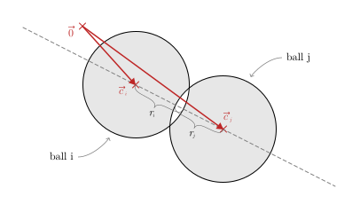

## goal
+ Simulate the motion of multiple balls.
+ There is no gravity, our simulation may be interpreted as a top-down view on a billiard table.
+ Collisions can happen with all the walls, and between each of the balls.
+ All balls, except one, are initially stationary.

<br>


## equations
+ info:
  - We don't have any forces involved here. All balls simply have velocities, masses, and radii, and balls collide, the new velocities are computed. No forces.
  - Because we have no (constant) forces involved here, we don't need to use the average velocities for each time step anymore. Think about it – the problem with the ball loosing height was tightly coupled to the gravity force.

<br>


$$
\text{--------- constants ---------}
$$

$$
\begin{aligned}
\text{\hspace{50pt}}
w &= \text{const.}\text{\small\color{gray}\hspace{14pt}(width of the scene)}\\
h &= \text{const.}\text{\small\color{gray}\hspace{14pt}(height of the scene)}\\[8pt]
\end{aligned}
$$


$$
\text{--------- time step ---------}
$$

$$
\text{\small\color{gray} (update the position -- for each ball)}
$$

$$
\begin{aligned}
x'_i &= x_i + dx_i  &  &\leftarrow  &  dx_i &= dt \cdot v_{x,i}\\[8pt]
y'_i &= y_i + dy_i  &  &\leftarrow  &  dy_i &= dt \cdot v_{y,i}\\[8pt]
\end{aligned}
$$


$$
\text{--------- ball-ball collisions ---------}
$$

$$
\text{\small\color{gray} (for every pair of balls, i and j, ...)}
$$

<div align="center"></div>

$$
\begin{gathered}
\vec{p}_i = \begin{pmatrix}x_i\\ y_i\end{pmatrix} \hspace{16pt} \vec{p}_j = \begin{pmatrix}x_j\\ y_j\end{pmatrix} \\[14pt]
\vec{d} = \vec{p}_{\hspace{.5pt}j} - \vec{p}_{\hspace{.5pt}i}\\[8pt]
\text{collision condition:\hspace{12pt}} |\,\vec{d}\:| < r_i + r_j\\[16pt]
\end{gathered}
$$

$$
\begin{gathered}
\text{\small\color{gray} (in case of collision ...)}\\[8pt]
\text{\small By neglecting friction, the balls essentially only collide}\\
\text{\small along the axis of their centers, like in a head-on collision.}\\
\text{\small The velocities perpendicular to the axis of centers}\\
\text{\small remain as they were before.}
\end{gathered}
$$

<div align="center">contribution: <a href="https://phys.libretexts.org/Bookshelves/Classical_Mechanics/Book%3A_Classical_Mechanics_(Tatum)/05%3A_Collisions/5.04%3A_Oblique_Collisions">libretexts.org</a></div>
<br><br>

<div align="center"></div>

$$
\begin{gathered}
\vec{v}_i = \begin{pmatrix}v_{x,i}\\ v_{y,i}\end{pmatrix} \hspace{16pt} \vec{v}_j = \begin{pmatrix}v_{x,j}\\ v_{y,j}\end{pmatrix} \\[14pt]
\vec{a} = \frac{1}{\vec{d}} \cdot \vec{d}
\end{gathered}
$$

$$
\begin{aligned}
v_{i,a} &= \vec{a} \:\circ \vec{v}_i & v_{j,a} &= \vec{a} \:\circ \vec{v}_j\\
\vec{v}_{i,a} &= v_{i,a} \cdot \vec{a} & \vec{v}_{j,a} &= v_{j,a} \cdot \vec{a}\\
\vec{v}_{i,b} &= \vec{v}_i - \vec{v}_{i,a} & \vec{v}_{j,b} &= \vec{v}_j - \vec{v}_{j,a}\\
\end{aligned}
$$

$$
\begin{aligned}
v'_{i,a} &= \frac{v_{i,a}(m_i - m_j) + 2m_jv_{j,a}}{m_i+m_j} & v'_{j,a} &= \frac{v_{j,a}(m_j - m_i) + 2m_iv_{i,a}}{m_i+m_j}\\
\end{aligned}
$$

$$
\begin{aligned}
\vec{v}\,'_{\!i,a} &= v'_{i,a} \cdot \vec{a} & \vec{v}\,'_{\!j,a} &= v'_{j,a} \cdot \vec{a}\\
\vec{v}\,'_{\!i,b} &= \vec{v}_{i,b} & \vec{v}\,'_{\!j,b} &= \vec{v}_{j,b}\\
\vec{v}\,'_{\!i} &= \vec{v}\,'_{\!i,a} + \vec{v}\,'_{\!i,b} & \vec{v}\,'_{\!j} &= \vec{v}\,'_{\!j,a} + \vec{v}\,'_{\!j,b}\\
\end{aligned}
$$

$$
\begin{aligned}
\begin{pmatrix}v'_{x,i}\\ v'_{y,i}\end{pmatrix} = \vec{v}\,'_{\!i} \hspace{16pt} \begin{pmatrix}v'_{x,j}\\ v'_{y,j}\end{pmatrix} = \vec{v}\,'_{\!j}\\[20pt]
\end{aligned}
$$


$$
\text{--------- ball-wall collisions ---------}
$$

$$
\text{\small\color{gray} (left and right wall -- for each ball)}
$$

$$
\begin{aligned}
v''_x =
\begin{cases}
    + \left| v'_x \right|, & \text{if}\:\:\: x-r \lt 0\\
    - \left| v'_x \right|, & \text{if}\:\:\: x+r \gt w\\
    v'_x,               & \text{otherwise}
\end{cases}\\[24pt]
\end{aligned}
$$

$$
\text{\small\color{gray} (top and bottom wall -- for each ball)}
$$

$$
\begin{aligned}
v''_y =
\begin{cases}
    + \left| v'_y \right|, & \text{if}\:\:\: y-r \lt 0\\
    - \left| v'_y \right|, & \text{if}\:\:\: y+r \gt h\\
    v'_y,               & \text{otherwise}
\end{cases}
\end{aligned}
$$

<br>

## code
```js
const balls = [
    {
        x: 0.5 * canvas.w,  // horizontally centered
        y: 0.2 * canvas.h,  // at the top
        v_x: 0,  // initially stationary
        v_y: 0,  //
        m: 1,
        r: 15,
        color: 'XXX',
    },
    {
        x: 0.5 * canvas.w,  // horizontally centered
        y: 0.2 * canvas.h,  // at the top
        v_x: 0,  // initially stationary
        v_y: 0,  //
        m: 1,
        r: 15,
        color: 'XXX',
    },
    // ...
];


function simulateOneStep(dt) {
    // ...
}
```

<br>


## the problem
+ ...

<br>


## working example <small>(for both update rule sets)</small>

||||
| --- | --- | --- |
| [Code]() | [Code Live]() | [Code Fiddle]() |
