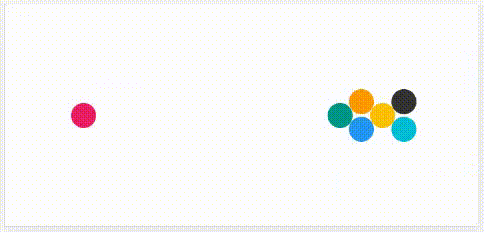
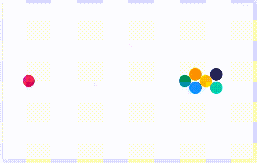

## goal
+ Simulate the motion of multiple balls.
+ There is no gravity, our simulation may be interpreted as a top-down view on a billiard table.
+ Collisions can happen with all the walls, and between each of the balls.
+ All balls, except one, are initially stationary.

<br>


## equations

<div align="center"></div><!--
\text{--------- constants ---------}
--><br>

<div align="center"></div><!--
\begin{aligned}
\text{\hspace{50pt}}
w &= \text{const.}\text{\small\color{Gray}\hspace{14pt}(width of the scene)}\\
h &= \text{const.}\text{\small\color{Gray}\hspace{14pt}(height of the scene)}\\[8pt]
\end{aligned}
--><br>


<div align="center"></div><!--
\text{--------- time step ---------}
--><br>

<div align="center"></div><!--
\text{\small\color{Gray} (for every ball i ...)}
--><br>

<div align="center"></div><!--
\text{\small\color{Gray} (new position, using the new velocity)}
--><br>

<div align="center"></div><!--
\begin{aligned}
x'_i &= x_i + dx_i  &  &\leftarrow  &  dx_i &= dt \cdot v_{x,i}\\[8pt]
y'_i &= y_i + dy_i  &  &\leftarrow  &  dy_i &= dt \cdot v_{y,i}\\[8pt]
\end{aligned}
--><br>


<div align="center"></div><!--
\text{--------- ball-ball collisions ---------}
--><br>

<div align="center"></div><!--
\text{\small\color{Gray} (for every pair of balls i and j ...)}
--><br>

<div align="center"></div>

<div align="center"></div><!--
\begin{gathered}
\vec{m}_i = \begin{pmatrix}x_i\\ y_i\end{pmatrix} \hspace{16pt} \vec{m}_j = \begin{pmatrix}x_j\\ y_j\end{pmatrix} \\[14pt]
\vec{d} = \vec{m}_{\hspace{.5pt}j} - \vec{m}_{\hspace{.5pt}i}\\[8pt]
\text{collision condition:\hspace{12pt}} |\,\vec{d}\:| < r_i + r_j\\[16pt]
\end{gathered}
--><br>

<div align="center"></div><!--
\begin{gathered}
\text{\small\color{Gray} (in case of collision ...)}\\[8pt]
\text{\small By neglecting friction, the balls essentially only collide}\\
\text{\small along the axis of their centers (direction s), like in }\\
\text{\small a head-on collision. The velocities perpendicular to }\\
\text{\small the axis of centers (direction t) remain as they were before.}
\end{gathered}
--><br>

<div align="center">contribution: <a href="https://phys.libretexts.org/Bookshelves/Classical_Mechanics/Book%3A_Classical_Mechanics_(Tatum)/05%3A_Collisions/5.04%3A_Oblique_Collisions">libretexts.org</a></div>
<br><br>

<div align="center"></div>

<div align="center"></div><!--
\begin{gathered}
\vec{v}_i = \begin{pmatrix}v_{x,i}\\ v_{y,i}\end{pmatrix} \hspace{16pt} \vec{v}_j = \begin{pmatrix}v_{x,j}\\ v_{y,j}\end{pmatrix} \\[14pt]
\vec{s} = \frac{1}{|\,\vec{d}\:|} \cdot \vec{d}
\end{gathered}
--><br>

<div align="center"></div><!--
\begin{aligned}
v_{i,s} &= \vec{s} \:\circ \vec{v}_i & v_{j,s} &= \vec{s} \:\circ \vec{v}_j\\
\vec{v}_{i,s} &= v_{i,s} \cdot \vec{s} & \vec{v}_{j,s} &= v_{j,s} \cdot \vec{s}\\
\vec{v}_{i,t} &= \vec{v}_i - \vec{v}_{i,s} & \vec{v}_{j,t} &= \vec{v}_j - \vec{v}_{j,s}\\
\end{aligned}
--><br>

<div align="center"></div><!--
\begin{aligned}
v'_{i,s} &= \frac{v_{i,s}(m_i - m_j) + 2m_jv_{j,s}}{m_i+m_j} & v'_{j,s} &= \frac{v_{j,s}(m_j - m_i) + 2m_iv_{i,s}}{m_i+m_j}\\
\end{aligned}
--><br>

<div align="center"></div><!--
\begin{aligned}
\vec{v}\,'_{\!i,s} &= v'_{i,s} \cdot \vec{s} & \vec{v}\,'_{\!j,s} &= v'_{j,s} \cdot \vec{s}\\
\vec{v}\,'_{\!i,t} &= \vec{v}_{i,t} & \vec{v}\,'_{\!j,t} &= \vec{v}_{j,t}\\
\vec{v}\,'_{\!i} &= \vec{v}\,'_{\!i,s} + \vec{v}\,'_{\!i,t} & \vec{v}\,'_{\!j} &= \vec{v}\,'_{\!j,s} + \vec{v}\,'_{\!j,t}\\
\end{aligned}
--><br>

<div align="center"></div><!--
\begin{aligned}
\begin{pmatrix}v'_{x,i}\\ v'_{y,i}\end{pmatrix} = \vec{v}\,'_{\!i} \hspace{16pt} \begin{pmatrix}v'_{x,j}\\ v'_{y,j}\end{pmatrix} = \vec{v}\,'_{\!j}\\[20pt]
\end{aligned}
--><br>


<div align="center"></div><!--
\text{--------- ball-wall collisions ---------}
--><br>

<div align="center"></div><!--
\text{\small\color{Gray} (left and right wall -- for each ball)}
--><br>

<div align="center"></div><!--
\begin{aligned}
v''_x =
    \begin{cases}
        - v'_x, & \text{if}\quad x < r \;\;\vee\;\; w-r < x\\
        v'_x, & \text{otherwise}
    \end{cases}\\[24pt]
\end{aligned}
--><br>

<div align="center"></div><!--
\text{\small\color{Gray} (top and bottom wall -- for each ball)}
--><br>

<div align="center"></div><!--
\begin{aligned}
v''_y =
    \begin{cases}
        - v'_y, & \text{if}\quad y < r \;\;\vee\;\; h-r < y\\
        v'_y, & \text{otherwise}
    \end{cases}
\end{aligned}
--><br>

<br>


## code
```js
const balls = [
    {
        x: 30,  // at the left
        y: 0.5 * canvas.h,  // vertically centered
        v_x: 10,  // moving straight to the right
        v_y: 0,   //
        m: 1,
        r: 15,
        color: '#E91E63',
    },
    {
        x: canvas.w - 50,  // at the right
        y: 0.5 * canvas.h,  // vertically centered
        v_x: 0,  // initially stationary
        v_y: 0,  //
        m: 1,
        r: 15,
        color: '#00BCD4',
    },

    // ...

];


function simulateOneStep(dt) {

    for (let ball of balls) {
        ball.x += dt * ball.v_x;
        ball.y += dt * ball.v_y;
    }

    forEachPair(balls, (i, j) => {

        const m_i = [i.x, i.y];
        const m_j = [j.x, j.y];

        const d = Vector.subtract(m_j, m_i);

        if (Vector.norm(d) < i.r + j.r) {

            const v_i = [i.v_x, i.v_y];
            const v_j = [j.v_x, j.v_y];

            const s = Vector.normalize(d);

            const v_is_value = Vector.dotProduct(s, v_i);
            const v_js_value = Vector.dotProduct(s, v_j);

            const v_is = Vector.scale(s, v_is_value);
            const v_js = Vector.scale(s, v_js_value);

            const v_it = Vector.subtract(v_i, v_is);
            const v_jt = Vector.subtract(v_j, v_js);

            const vˈ_is_value = (
                v_is_value * (i.m -j.m) + 2 * j.m * v_js_value
            ) / (
                i.m + j.m
            );
            const vˈ_js_value = (
                v_js_value * (j.m -i.m) + 2 * i.m * v_is_value
            ) / (
                i.m + j.m
            );

            const vˈ_is = Vector.scale(s, vˈ_is_value);
            const vˈ_js = Vector.scale(s, vˈ_js_value);

            const vˈ_it = v_it;
            const vˈ_jt = v_jt;

            const vˈ_i = Vector.add(vˈ_is, vˈ_it);
            const vˈ_j = Vector.add(vˈ_js, vˈ_jt);

            [i.v_x, i.v_y] = vˈ_i;
            [j.v_x, j.v_y] = vˈ_j;
        }
    });

    for (let ball of balls) {
        if (ball.x < ball.r || canvas.w - ball.r < ball.x) {
            ball.v_x *= -1;
        }
        if (ball.y < ball.r || canvas.h - ball.r < ball.y) {
            ball.v_y *= -1;
        }
    }
}

function forEachPair(array, callback) {
    for (let i = 0; i < array.length; i++) {  // loop every item
        for (let j = i + 1; j < array.length; j++) { // loop every item after the current item
            callback(array[i], array[j], i, j);
        }
    }
}
```

<br>


## discussion of the time step equations
+ In this level we have utilized the most simple time step equations, like initially in level 2 and level 3.
+ In contrast to level 2 and level 3, averaging velocities really makes no sense here, because velocities are not gradually changing due to an acceleration. We only instantaneously update velocities (deterministic collisions) on collisions. Between collisions a ball's velocity remains constant - no need to average it xD.

<br>


## collision problems
+ Glitcheees <3
  <div align="center"></div>

<br>

+ Problem (1):
  - Balls stick in each other and spin fast xD.
+ Reason (1):
  - In our simulation, we strictly process collision sequentially (one after another), even if a ball actually collides (overlaps) with multiple other balls and not just one. The resulting behavior could be named "The Last Collision Wins".
  - When multiple balls collide in a dense bulk, then the "The Last Collision Wins" rule can push two balls (that would normally bounce off each other) deep into each other (if the collisions with the other balls happen after the collision between the two balls).
  - If then the outer balls retract, the two inner balls keep sticking in each other, because they repeatedly reflect away from each other and then towards each other again. This is because the collision condition only checks whether the two balls geometrically overlap, which keeps being true because they were pushed so deep into each other that the step away from each other does not suffice to separate them.
  - And the reason for the balls orbiting around each other is that in an oblique collision the velocity perpendicular to the line of centers is preserved, while the velocity along the line of centers keeps switching direction (effectively cancels out).
+ Solution (1):
  - We can simply extend our ball-ball collision condition, to not only check whether the balls are overlapping, but also whether the balls are actually moving towards each other xD.
<br>

+ Problem (2):
  - Balls sometimes stick in the wall xD.
+ Reason (2):
  - When a ball overlaps with the wall, and due to collision with another ball (at the same time) has a velocity directed away from the wall, then our wall collision actually sucks in our ball instead of reflecting it (because we simply reverse the velocity).
  - And once a ball is two steps in the wall, it can't free itself anymore. It keeps jumping one step forwards and one step backwards, not "leaving" the wall.
+ Solution (2):
  - Yo, let's simply extend our ball-wall collision condition, to not only check whether the ball overlaps with the wall, but also whether the ball is actually moving into the wall ^^.

<br>


## equations <small>(with glitch prevention) (only what changed)</small>
<div align="center"></div><!--
\text{--------- ball-ball collisions ---------}
--><br>

<div align="center"></div><!--
\text{\small\color{Gray} (for every pair of balls, i and j, ...)}
--><br>

<div align="center"></div><!--
\begin{gathered}
\vec{m}_i = \begin{pmatrix}x_i\\ y_i\end{pmatrix} \hspace{16pt} \vec{m}_j = \begin{pmatrix}x_j\\ y_j\end{pmatrix} \\[14pt]
\vec{d} = \vec{m}_{\hspace{.5pt}j} - \vec{m}_{\hspace{.5pt}i}\\[8pt]
\vec{s} = \frac{1}{|\,\vec{d}\:|} \cdot \vec{d}
\end{gathered}
--><br>

<div align="center"></div><!--
\begin{aligned}
\vec{v}_i &= \begin{pmatrix}v_{x,i}\\ v_{y,i}\end{pmatrix}  &\hspace{16pt} \vec{v}_j &= \begin{pmatrix}v_{x,j}\\ v_{y,j}\end{pmatrix} \\[14pt]
v_{i,s} &= \vec{s} \:\circ \vec{v}_i & v_{j,s} &= \vec{s} \:\circ \vec{v}_j\\[14pt]
\end{aligned}
--><br>

<div align="center"></div><!--
\begin{gathered}
\text{collision condition:\hspace{12pt}} |\,\vec{d}\:| < r_i + r_j \quad\wedge\quad v_{i,s} > v_{j,s}\\[20pt]
\end{gathered}
--><br>

<div align="center"></div><!--
\text{--------- ball-wall collisions ---------}
--><br>

<div align="center"></div><!--
\text{\small\color{Gray} (left and right wall -- for each ball)}
--><br>

<div align="center"></div><!--
\begin{aligned}
v''_x =
    \begin{cases}
        - v'_x, & \text{if}\quad (x < r) \wedge (v_x < 0) \;\;\vee\;\; (w-r < x) \wedge (0 < v_x)\\
        v'_x, & \text{otherwise}
    \end{cases}\\[24pt]
\end{aligned}
--><br>

<div align="center"></div><!--
\text{\small\color{Gray} (top and bottom wall -- for each ball)}
--><br>

<div align="center"></div><!--
\begin{aligned}
v''_y =
    \begin{cases}
        - v'_y, & \text{if}\quad (y < r) \wedge (v_y < 0) \;\;\vee\;\; (h-r < y) \wedge (0 < v_y)\\
        v'_y, & \text{otherwise}
    \end{cases}\\[24pt]
\end{aligned}
--><br>

<br>


## code <small>(with glitch prevention) (only what changed)</small>
```js
// ...

function simulateOneStep(dt) {

    // ...
    
    forEachPair(balls, (i, j) => {

        const m_i = [i.x, i.y];
        const m_j = [j.x, j.y];

        const d = Vector.subtract(m_j, m_i);

        const s = Vector.normalize(d);

        const v_i = [i.v_x, i.v_y];
        const v_j = [j.v_x, j.v_y];

        const v_is_value = Vector.dotProduct(s, v_i);
        const v_js_value = Vector.dotProduct(s, v_j);

        if (
            (Vector.norm(d) < i.r + j.r) &&
            (v_is_value > v_js_value)
        ) {

            // ...
        }
    });

    for (let ball of balls) {
        if (
            ball.x < ball.r && ball.v_x < 0 ||
            canvas.w - ball.r < ball.x && ball.v_x > 0
        ) {
            ball.v_x *= -1;
        }
        if (
            ball.y < ball.r && ball.v_y < 0 ||
            canvas.h - ball.r < ball.y && ball.v_y > 0
        ) {
            ball.v_y *= -1;
        }
    }
}
```

<br>

## inaccuracy problem
+ (1) Collisions of multiple balls at once are not realistic in the current simulation.
  - In this example the balls should actually move on symmetric paths. But they don't.
  <div align="center"></div>
+ Reason:
  - In our simulation, we process collision sequentially (one after another). This "The Last Collision Wins" rule explains why the balls aren't moving symmetrically right from the start.
+ Weakening Factor:
  - Normally, collisions are so fast, that we can't really see if they should have lead to different results, because the balls actually collided simultaneously instead of one after another.
  - Normally, everything looks fine to the observer of the simulation.
  - It's only in special cases, like the kickoff at the start, that the inaccuracy becomes obvious. Only under these special conditions we have clear predictions of the collision results.
+ Solution:
  - We will tackle that in the next two upcoming levels :P

<br>


## working example <small>(for all variants)</small>

|||
| --- | --- |
| [Code](https://github.com/pitizzzle/physics-simulations-balls/blob/main/code/level-4-ball-deterministic-collisions.html) | [Code Live](https://pitizzzle.github.io/simulate-ball-physics/code/level-4-ball-deterministic-collisions.html) |
