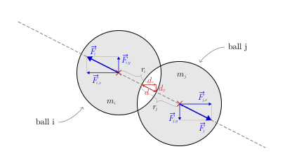

## goal
+ The same as in level 4, but more accurate when multiple balls collide at once.

 

## new idea
+ Instead of computing the results of individual collisions deterministically, we can also simulate the deformation process of each ball when it hits something.
  - [GIF SMARTER EVERY DAY GOLF BALL]
+ The deformation process is modeled by a spring according to [Hooke's Law](https://en.wikipedia.org/wiki/Hooke%27s_law).

 

## equations
$$
\text{--------- constants ---------}
$$

$$
\begin{aligned}
\text{\hspace{50pt}}
w &= \text{const.}\text{\small\color{gray}\hspace{14pt}(width of the scene)}\\
h &= \text{const.}\text{\small\color{gray}\hspace{14pt}(height of the scene)}\\
k &= \text{const.}\text{\small\color{gray}\hspace{14pt}(spring stiffness)}\\[14pt]
\end{aligned}
$$

$$
\text{--------- ball-ball collisions ---------}
$$

$$
\text{\small\color{gray} (for every pair of balls i and j ...)}
$$

$$
\begin{aligned}
s_x &= x_j - x_i\\
s_y &= y_j - y_i\\
s &= \sqrt{d_x^{\,2} + d_y^{\,2}}\\[8pt]
\end{aligned}
$$

$$
\begin{gathered}
\text{collision condition:\hspace{12pt}} s < r_i + r_j\\[16pt]
\end{gathered}
$$

$$
\begin{aligned}
F_{j,x} &=
    \begin{cases}
        s \cdot k \cdot \frac{s_x}{s}, & \text{if collision}\\
        0, & \text{otherwise}
    \end{cases}\\[16pt]
F_{j,y} &=
    \begin{cases}
        s \cdot k \cdot \frac{s_y}{s}, & \text{if collision}\\
        0, & \text{otherwise}
    \end{cases}\\[24pt]
F_{i,x} &= - F_{j,x}\\
F_{i,y} &= - F_{j,y}\\[16pt]
\end{aligned}
$$

$$
\text{--------- ball-wall collisions ---------}
$$

$$
\begin{gathered}
\text{\small\color{gray} (for every ball i ...)}
\end{gathered}
$$

$$
\text{\small\color{gray} (left and right wall)}
$$

$$
\begin{aligned}
F'_{i,x} =
    \begin{cases}
        F_{i,x} + (r_i-x_i) \cdot k, & \text{if}\quad 0 \lt r_i-x_i\\
        F_{i,x} - (x_i+r_i-w) \cdot k,\quad & \text{if}\quad 0 \lt x_i+r_i-w\\
        F_{i,x}, & \text{otherwise}
    \end{cases}\\[24pt]
\end{aligned}
$$

$$
\text{\small\color{gray} (top and bottom wall)}
$$

$$
\begin{aligned}
F'_{i,y} =
    \begin{cases}
        F_{i,y} + (r_i-y_i) \cdot k, &\text{if}\quad 0 \lt r_i-y_i\\
        F_{i,y} - (y_i+r_i-h) \cdot k,\quad & \text{if}\quad 0 \lt y_i+r_i-h\\
        F_{i,y}, & \text{otherwise}
    \end{cases}\\[24pt]
\end{aligned}
$$

$$
\text{--------- time step ---------}
$$

$$
\begin{gathered}
\text{\small\color{gray} (for every ball i ...)}
\end{gathered}
$$

$$
\text{\small\color{gray} (new acceleration, which is constant during the time step)}
$$

$$
\begin{aligned}
a_{i,x} &= \frac{F'_{i,x}}{m}\\[8pt]
a_{i,y} &= \frac{F'_{i,y}}{m}\\[8pt]
\end{aligned}
$$

$$
\text{\small\color{gray} (update the velocity, which is constant during the time step)}
$$

$$
\begin{aligned}
v'_{i,x} &= v_{i,x} + dv_{i,x}  &  &\leftarrow  &  dv_{i,x} &= dt \cdot a_{i,x}\\[4pt]
v'_{i,y} &= v_{i,y} + dv_{i,y}  &  &\leftarrow  &  dv_{i,y} &= dt \cdot a_{i,y}\\[8pt]
\end{aligned}
$$

$$
\text{\small\color{gray} (update the position)}
$$

$$
\begin{aligned}
x'_i &= x_i + dx_i  &  &\leftarrow  &  dx_i &= dt \cdot v_{i,x}\\[4pt]
y'_i &= y_i + dy_i  &  &\leftarrow  &  dy_i &= dt \cdot v_{i,y}\\[14pt]
\end{aligned}
$$

