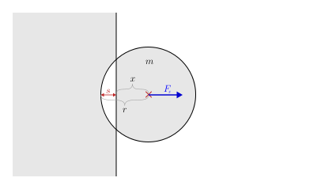

## goal
+ The same as in level 3, but using spring collisions.
  - Simulate a ball that bounces off all the walls if it touches them.
  - The ball is initially stationary, and gravity is constantly acting on it downwards.

<br>


## new idea
+ Instead of computing the results of individual collisions deterministically, we can also simulate an elastic deformation process when a ball hits a wall.
  <div align="center"><br>contribution: <a href="https://www.youtube.com/watch?v=JT0wx27J9xs" target="_blank">SmarterEveryDay</a></div><br>

+ The deformation process is modeled by a spring that sits between the two colliding objects.
  - Its initial length is 0 and when the two objects bump deeper into each other, the spring is extended.
  <div align="center"></div>

  - The extended spring then pulls the objects out of each other, because it wants to return to its initial length 0, by applying a force on both objects that is proportional to the distance of extension, according to [Hooke's Law](https://en.wikipedia.org/wiki/Hooke%27s_law).
  $$
  F = s \cdot k
  $$
  - The force of this spring acts equally on both objects, but in opposite directions, pulling them out of each other (or rather pushing them away from each other).
  - Naturally, we don't want the wall to react to that force. Physically speaking, it has an infinite mass.
  - The spring force first slows down the ball's velocity down to zero. And because the ball still overlaps with the wall, the spring then accelerates the ball in the other direction and out of the wall.
  - This models an elastic deformation process, because just like in an actual deformation process, the deeper an object bumps into another object, the more it is deformed, storing the energy like a spring in the the internal material tension. The only difference is, that we don't keep track of the energy stored in the spring, or something like this. It is totally sufficient to simulate the force the spring applies to a ball, based on the depth of penetration.

<br>


## equations

$$
\text{--------- constants ---------}
$$

$$
\begin{aligned}
\text{\hspace{50pt}}
m &= \text{const.}\text{\small\color{Gray}\hspace{14pt}(mass of the ball)}\\
g &= \text{const.}\text{\small\color{Gray}\hspace{14pt}(gravity constant)}\\
r&=\text{const.}\text{\small\color{Gray}\hspace{14pt}(radius of the ball)}\\
w&=\text{const.}\text{\small\color{Gray}\hspace{14pt}(width of the scene)}\\
h&=\text{const.}\text{\small\color{Gray}\hspace{14pt}(height of the scene)}\\[8pt]
\end{aligned}
$$

$$
\text{--------- constants ---------}
$$

$$
\begin{aligned}
\text{\hspace{50pt}}
w &= \text{const.}\text{\small\color{Gray}\hspace{14pt}(width of the scene)}\\
h &= \text{const.}\text{\small\color{Gray}\hspace{14pt}(height of the scene)}\\
k &= \text{const.}\text{\small\color{Gray}\hspace{14pt}(spring stiffness)}\\[14pt]
\end{aligned}
$$


$$
\text{--------- ball-wall collisions ---------}
$$

<div align="center"></div>

$$
\text{\small\color{Gray} (left and right wall)}
$$

$$
\begin{aligned}
F'_{x} =
    \begin{cases}
        + (r-x) \cdot k, & \text{if}\quad 0 < r-x\\
        - (x+r-w) \cdot k,\quad & \text{if}\quad 0 < x+r-w\\
        0, & \text{otherwise}
    \end{cases}\\[24pt]
\end{aligned}
$$

$$
\text{\small\color{Gray} (top and bottom wall)}
$$

$$
\begin{aligned}
F'_{i,y} =
    \begin{cases}
        + (r-y) \cdot k, &\text{if}\quad 0 < r-y\\
        - (y+r-h) \cdot k,\quad & \text{if}\quad 0 < y+r-h\\
        0, & \text{otherwise}
    \end{cases}\\[24pt]
\end{aligned}
$$

$$
\text{--------- time step ---------}
$$

$$
\text{\small\color{Gray} (new force, which is constant during the time step)}
$$

$$
\begin{aligned}
F''_x &= F'_x\\[8pt]
F''_y &= F'_y + m \cdot g\\[8pt]
\end{aligned}
$$

$$
\text{\small\color{Gray} (new acceleration, which is constant during the time step)}
$$

$$
\begin{aligned}
a'_x &= \frac{F''_x}{m}\\[8pt]
a'_y &= \frac{F''_y}{m}\\[8pt]
\end{aligned}
$$

$$
\text{\small\color{Gray} (new velocity after the time step)}
$$

$$
\begin{aligned}
v'_x &= v_x + dv_x  &  &\leftarrow  &  dv_x &= dt \cdot a'_x\\[4pt]
v'_y &= v_y + dv_y  &  &\leftarrow  &  dv_y &= dt \cdot a'_y\\[8pt]
\end{aligned}
$$

$$
\text{\small\color{Gray} (new position, using the new velocity)}
$$

$$
\begin{aligned}
x' &= x + dx  &  &\leftarrow  &  dx &= dt \cdot v'_x\\[4pt]
y' &= y + dy  &  &\leftarrow  &  dy &= dt \cdot v'_y\\[14pt]
\end{aligned}
$$

<br>


## code
```js
const ball = {
    x: 0.5 * canvas.w,  // horizontally centered
    y: 0.2 * canvas.h,  // at the top
    v_x: 0,  // initially stationary
    v_y: 0,  //
    m: 1,
    r: 15,
};

const g = 0.7;  // gravity constant
const k = 5;  // spring stiffness

function simulateOneStep(dt) {

    ball.F_x = 0;           // reset/initialize
    ball.F_y = ball.m * g;  //

    if (ball.x - ball.r < 0) {
        ball.F_x -= (ball.x - ball.r) * k;
    }
    if (ball.x + ball.r - canvas.w > 0) {
        ball.F_x -= (ball.x + ball.r - canvas.w) * k;
    }
    if (ball.y - ball.r < 0) {
        ball.F_y -= (ball.y - ball.r) * k;
    }
    if (ball.y + ball.r - canvas.h > 0) {
        ball.F_y -= (ball.y + ball.r - canvas.h) * k;
    }

    const a_x = ball.F_x / ball.m;
    const a_y = ball.F_y / ball.m;
    ball.v_x += dt * a_x;
    ball.v_y += dt * a_y;
    ball.x += dt * ball.v_x;
    ball.y += dt * ball.v_y;
}
```

<br>


## discussion of the time step equations
+ In this level we have utilized the most simple time step equations, like initially in level 2 and level 3.
  - We compute a new acceleration, with that compute the velocity after the time step, and then compute the new position, assuming that the new velocity is already constantly present during the time step itself.

+ However, unlike in level 2 or level 3, where using the average velocity to update the position is beneficial or even required, we MUST NOT USE IT for spring collisions.
  - Reason 1 (minor): We can't argue anymore that averaging the velocity would slightly increase accuracy. This is because acceleration is not strictly constant anymore (in collisions the acceleration changes dynamically). And with dynamically changing acceleration, assuming the acceleration to be constant during a time step is already such a big approximation that it would be hilarious to say that avering the velocity would significantly increase accuracy.
  - Reason 2 (important): Spring collisions are really sensitive to the time step equations (similar to the ball jumping lower and lower in level 3). The ball would actually jump higher and higher if we used the average velocity to update the ball's position. This is explained in the next paragraph.
  $$
  \begin{aligned}
  a'_x &= \frac{F''_x}{m}\\[8pt]
  a'_y &= \frac{F''_y}{m}\\[8pt]
  v'_x &= v_x + dv_x  &  &\leftarrow  &  dv_x &= dt \cdot a'_x\\[4pt]
  v'_y &= v_y + dv_y  &  &\leftarrow  &  dv_y &= dt \cdot a'_y\\[4pt]
  x' &= x + dx  &  &\leftarrow  &  dx&= dt \cdot \dfrac{v_x + v'_x}{2}\\[8pt]
  y' &= y + dy  &  &\leftarrow  &  dy&= dt \cdot \dfrac{v_y + v'_y}{2}\\[8pt]
  \end{aligned}
  $$
  ```js
  const a_x = ball.F_x / ball.m;
  const a_y = ball.F_y / ball.m;
  const v_x_old = ball.v_x;
  const v_y_old = ball.v_y;
  ball.v_x += dt * a_x;
  ball.v_y += dt * a_y;
  ball.x += dt * 0.5 * (v_x_old + ball.v_x);
  ball.y += dt * 0.5 * (v_y_old + ball.v_y);
  ```
  <div align="center"></div><br>

+ Explanation for Reason 2 and the influence of delayed velocity:
  - If we update the position of the ball with the averaged velocity, the ball is always updated with a slightly older velocity than if we only took the new velocity. It seems like this slightly older velocity results in the ball falling deeper into the ground than it should, resulting in larger accelerations on the ball, resulting in the fact that ball jumps up again with a higher velocity than it approached with.
  - If we stick to the time step equations from above, we don't have a delayed velocity, because we assume the new velocity after time step to be already constantly present during the time step itself.
  <br>

+ This theory of delayed velocity can be evidenced by two experiments:
  - (1) Delaying the the velocity used to update the ball's position even further, and obverserving that the ball gains even more speed on each collision.
    * The theory would explain this like that: "Because of the delayed velocity used to update the ball's position, the ball falls deeper into the ground and receives more upward acceleration."
    $$
    \begin{aligned}
    a'_x &= \frac{F''_x}{m}\\[8pt]
    a'_y &= \frac{F''_y}{m}\\[8pt]
    v'_x &= v_x + dv_x  &  &\leftarrow  &  dv_x &= dt \cdot \dfrac{a_x + a'_x}{2}\\[8pt]
    v'_y &= v_y + dv_y  &  &\leftarrow  &  dv_y &= dt \cdot \dfrac{a_y + a'_y}{2}\\[8pt]
    x' &= x + dx  &  &\leftarrow  &  dx&= dt \cdot \dfrac{v_x + v'_x}{2}\\[8pt]
    y' &= y + dy  &  &\leftarrow  &  dy&= dt \cdot \dfrac{v_y + v'_y}{2}\\[8pt]
    \end{aligned}
    $$
    ```js
    const F_x_old = ball.F_x;
    const F_y_old = ball.F_y;

    // ...

    const a_x = ball.F_x / ball.m;
    const a_y = ball.F_y / ball.m;

    const a_x_old = F_x_old / ball.m;
    const a_y_old = F_y_old / ball.m;
    const v_x_old = ball.v_x;
    const v_y_old = ball.v_y;
    ball.v_x += dt * 0.5 * (a_x_old + a_x);
    ball.v_y += dt * 0.5 * (a_y_old + a_y);
    
    ball.x += dt * 0.5 * (v_x_old + ball.v_x);
    ball.y += dt * 0.5 * (v_y_old + ball.v_y);
    ```
    <div align="center"></div><br>

  - (2) Anti-delaying the velocity used to update the ball's position, by predicting the next acceleration and using the average acceleration to update the velocity, and observing that the ball actually loses speed with every collision.
    * The theory would explain this like that: "Because of the anti-delayed velocity used to update ball's position, the ball quickly responds to the collision force and already leaves the ground before having gained full speed again."
    <!--$$
    \begin{aligned}
    a'_x &= \frac{F''_x}{m}\\[8pt]
    a'_y &= \frac{F''_y}{m}\\[8pt]
    v'_x &= v_x + dv_x  &  &\leftarrow  &  dv_x &= dt \cdot \dfrac{a_x + a'_x}{2}\\[8pt]
    v'_y &= v_y + dv_y  &  &\leftarrow  &  dv_y &= dt \cdot \dfrac{a_y + a'_y}{2}\\[8pt]
    x' &= x + dx  &  &\leftarrow  &  dx&= dt \cdot \dfrac{v_x + v'_x}{2}\\[8pt]
    y' &= y + dy  &  &\leftarrow  &  dy&= dt \cdot \dfrac{v_y + v'_y}{2}\\[8pt]
    \end{aligned}
    $$-->
    ```js
    const F_x_old = ball.F_x;
    const F_y_old = ball.F_y;

    // ...

    const a_x = ball.F_x / ball.m;
    const a_y = ball.F_y / ball.m;

    const a_x_old = F_x_old / ball.m;
    const a_y_old = F_y_old / ball.m;
    const a_x_next_prediction = a_x + (a_x - a_x_old);
    const a_y_next_prediction = a_y + (a_y - a_y_old);
    const v_x_old = ball.v_x;
    const v_y_old = ball.v_y;
    ball.v_x += dt * 0.5 * (a_x + a_x_next_prediction);
    ball.v_y += dt * 0.5 * (a_y + a_y_next_prediction);

    ball.x += dt * ball.v_x;
    ball.y += dt * ball.v_y;
    ```
    <div align="center"></div>

<br>


## working example <small>(for all variants)</small>

|||
| --- | --- |
| [Code](https://github.com/pitizzzle/physics-simulations-balls/blob/main/code/level-5-wall-spring-collisions.html) | [Code Live](https://pitizzzle.github.io/simulate-ball-physics/code/level-5-wall-spring-collisions.html) |
