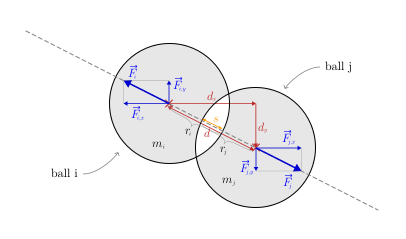

## goal
+ The same as in level 4, but using spring collisions and having more accuracy when multiple balls collide simulatenously (apparent after the kick-off at the beginning).
  - Simulate the motion of multiple balls.
  - There is no gravity, our simulation may be interpreted as a top-down view on a billiard table.
  - Collisions can happen with all the walls, and between each of the balls.
  - All balls, except one, are initially stationary.

<br>


## spring collisions for ball-ball collisions
+ The spring collisions for ball-ball collisions work exactly like the spring collisions when a ball collides with a wall (level 5).
+ The deformation process is modeled by a spring that sits between the two balls with initial length 0 and which is extended when the balls bump deeper into each other.
  <div align="center"></div>

  - The extended spring then deaccelerates both balls until they have the same velocity and then pulls them out of each other again, by applying an opposite but equal force on both that is proportional to its extension length, according to [Hooke's Law](https://en.wikipedia.org/wiki/Hooke%27s_law).
<br>


## equations
<div align="center"></div><!--
\text{--------- constants ---------}
--><br>

<div align="center"></div><!--
\begin{aligned}
\text{\hspace{50pt}}
w &= \text{const.}\text{\small\color{Gray}\hspace{14pt}(width of the scene)}\\
h &= \text{const.}\text{\small\color{Gray}\hspace{14pt}(height of the scene)}\\
k &= \text{const.}\text{\small\color{Gray}\hspace{14pt}(spring stiffness)}\\[14pt]
\end{aligned}
--><br>


<div align="center"></div><!--
\text{--------- ball-ball collisions ---------}
--><br>

<div align="center"></div><!--
\text{\small\color{Gray} (for every pair of balls i and j ...)}
--><br>

<div align="center"></div>

<div align="center"></div><!--
\begin{aligned}
d_x &= x_j - x_i\\
d_y &= y_j - y_i\\
d &= \sqrt{d_x^{\,2} + d_y^{\,2}} + 0.000001 \quad\begin{gathered}\text{\small\color{Gray}(prevent division}\\[-4pt] \text{\small\color{Gray}with zero later)}\end{gathered}\\
s &= r_i + r_j - d\\
\end{aligned}
--><br>

<div align="center"></div><!--
\begin{gathered}
\text{collision condition:\hspace{12pt}} 0 < s\\[8pt]
\end{gathered}
--><br>

<div align="center"></div><!--
\text{\small\color{Gray} (force on ball j)}
--><br>

<div align="center"></div><!--
\begin{aligned}
F'_{j,x,i} &=
    \begin{cases}
        s \cdot k \cdot \dfrac{d_x}{d}, & \text{if collision}\\
        0, & \text{otherwise}
    \end{cases}\\[16pt]
F'_{j,y,i} &=
    \begin{cases}
        s \cdot k \cdot \dfrac{d_y}{d}, & \text{if collision}\\
        0, & \text{otherwise}
    \end{cases}\\[18pt]
\end{aligned}
--><br>

<div align="center"></div><!--
\text{\small\color{Gray} (force on ball i)}
--><br>

<div align="center"></div><!--
\begin{aligned}
F'_{i,x,j} &= - F'_{j,x,i}\\
F'_{i,y,j} &= - F'_{j,y,i}\\[10pt]
\end{aligned}
--><br>

<div align="center"></div><!--
\text{\small\color{Gray} (for every ball i ...)}
--><br>

<div align="center"></div><!--
\begin{aligned}
F'_{i,x} &= \sum_{\text{other balls } j}F'_{i,x,j}\\[12pt]
F'_{i,y} &= \sum_{\text{other balls } j}F'_{i,y,j}\\[28pt]
\end{aligned}
--><br>


<div align="center"></div><!--
\text{--------- ball-wall collisions ---------}
--><br>

<div align="center"></div><!--
\text{\small\color{Gray} (for every ball i ...)}
--><br>

<div align="center"></div><!--
\text{\small\color{Gray} (left and right wall)}
--><br>

<div align="center"></div><!--
\begin{aligned}
F''_{i,x} =
    \begin{cases}
        F'_{i,x} + (r_i-x_i) \cdot k, & \text{if}\quad 0 < r_i-x_i\\
        F'_{i,x} - (x_i+r_i-w) \cdot k,\quad & \text{if}\quad 0 < x_i+r_i-w\\
        F'_{i,x}, & \text{otherwise}
    \end{cases}\\[24pt]
\end{aligned}
--><br>

<div align="center"></div><!--
\text{\small\color{Gray} (top and bottom wall)}
--><br>

<div align="center"></div><!--
\begin{aligned}
F''_{i,y} =
    \begin{cases}
        F'_{i,y} + (r_i-y_i) \cdot k, &\text{if}\quad 0 < r_i-y_i\\
        F'_{i,y} - (y_i+r_i-h) \cdot k,\quad & \text{if}\quad 0 < y_i+r_i-h\\
        F'_{i,y}, & \text{otherwise}
    \end{cases}\\[24pt]
\end{aligned}
--><br>


<div align="center"></div><!--
\text{--------- time step ---------}
--><br>

<div align="center"></div><!--
\text{\small\color{Gray} (for every ball i ...)}
--><br>

<div align="center"></div><!--
\text{\small\color{Gray} (new acceleration, which is constant during the time step)}
--><br>

<div align="center"></div><!--
\begin{aligned}
a'_{i,x} &= \frac{F''_{i,x}}{m}\\[8pt]
a'_{i,y} &= \frac{F''_{i,y}}{m}\\[8pt]
\end{aligned}
--><br>

<div align="center"></div><!--
\text{\small\color{Gray} (new velocity after the time step)}
--><br>

<div align="center"></div><!--
\begin{aligned}
v'_{i,x} &= v_{i,x} + dv_{i,x}  &  &\leftarrow  &  dv_{i,x} &= dt \cdot a'_{i,x}\\[4pt]
v'_{i,y} &= v_{i,y} + dv_{i,y}  &  &\leftarrow  &  dv_{i,y} &= dt \cdot a'_{i,y}\\[8pt]
\end{aligned}
--><br>

<div align="center"></div><!--
\text{\small\color{Gray} (new position, using the new velocity)}
--><br>

<div align="center"></div><!--
\begin{aligned}
x'_i &= x_i + dx_i  &  &\leftarrow  &  dx_i &= dt \cdot v'_{i,x}\\[4pt]
y'_i &= y_i + dy_i  &  &\leftarrow  &  dy_i &= dt \cdot v'_{i,y}\\[14pt]
\end{aligned}
--><br>

<br>


## code equivalent
```js
const balls = [
    {
        x: 30,  // at the left
        y: 0.5 * canvas.h,  // vertically centered
        v_x: 10,  // moving straight to the right
        v_y: 0,   //
        m: 1,
        r: 15,
        color: '#E91E63',
    },
    {
        x: canvas.w - 50,  // at the right
        y: 0.5 * canvas.h,  // vertically centered
        v_x: 0,  // initially stationary
        v_y: 0,  //
        m: 1,
        r: 15,
        color: '#00BCD4',
    },

    // ...

];

const k = 5;  // spring stiffness

function simulateOneStep(dt) {

    for (let ball of balls) {
        ball.F_x = ball.F_y = 0;  // reset/initialize
    }

    forEachPair(balls, (i, j) => {
        const d_x = i.x - j.x;
        const d_y = i.y - j.y;
        const d = Math.sqrt(d_x ** 2 + d_y ** 2) + 0.000001;  // '+0.000001' prevents division with zero later
        const s = i.r + j.r - d;
        if (0 < s) {
            i.F_x += s * k * (d_x / d);
            i.F_y += s * k * (d_y / d);
            j.F_x -= s * k * (d_x / d);
            j.F_y -= s * k * (d_y / d);
        }
    });
    for (let ball of balls) {
        if (ball.x - ball.r < 0) {
            ball.F_x -= (ball.x - ball.r) * k;
        }
        if (ball.x + ball.r - canvas.w > 0) {
            ball.F_x -= (ball.x + ball.r - canvas.w) * k;
        }
        if (ball.y - ball.r < 0) {
            ball.F_y -= (ball.y - ball.r) * k;
        }
        if (ball.y + ball.r - canvas.h > 0) {
            ball.F_y -= (ball.y + ball.r - canvas.h) * k;
        }
    }

    for (let ball of balls) {
        const a_x = ball.F_x / ball.m;
        const a_y = ball.F_y / ball.m;
        ball.v_x += dt * a_x;
        ball.v_y += dt * a_y;
        ball.x += dt * ball.v_x;
        ball.y += dt * ball.v_y;
    }
}

function forEachPair(array, callback) {
    for (let i = 0; i < array.length; i++) {  // loop every item
        for (let j = i + 1; j < array.length; j++) { // loop every item after the current item
            callback(array[i], array[j], i, j);
        }
    }
}
```

<br>


## discussion of the time step equations
+ See level 5.

<br>


## working example

|||
| --- | --- |
| [Code](https://github.com/pitizzzle/physics-simulations-balls/blob/main/code/level-6-ball-spring-collisions.html) | [Code Live](https://pitizzzle.github.io/simulate-ball-physics/code/level-6-ball-spring-collisions.html) |
